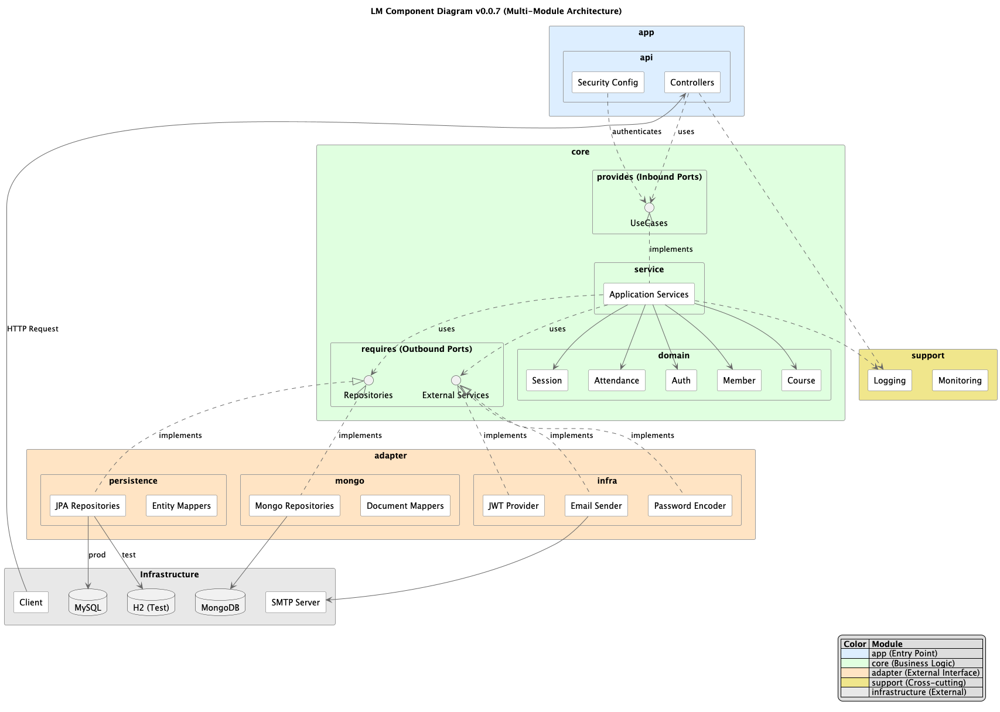

# Learning Manager

> **v0.0.9** | 스터디 과정 관리 및 출석 시스템

회원의 온/오프라인 스터디 과정을 지원하는 백엔드 서비스입니다. 출석 관리, 일정 관리 등 반복적이고 비효율적인 업무를 자동화하여 **학습 과정 자체에 집중할 수 있는 인프라**를 제공합니다.

---

## 프로젝트 목표

1. **학습에만 집중할 수 있는 스터디 인프라 제공**
2. **유지보수를 염두에 둔 확장 가능한 시스템 설계**
3. **헥사고날 아키텍처 기반의 도메인 중심 설계**

---

## 주요 기능

### MVP (Minimum Viable Product)

| 우선순위 | 기능        | 설명                              | 구현 상태 |
|:----:|-----------|---------------------------------|:-----:|
|  P0  | 회원 관리     | 가입, 로그인, 프로필 관리                 | 구현 완료 |
|  P0  | JWT 인증    | Access Token + Refresh Token 기반 | 구현 완료 |
|  P0  | 스터디 과정 관리 | 과정 생성/수정/삭제, 멤버 관리              | 구현 완료 |
|  P0  | 스터디 세션 관리 | 세션 생성/수정/삭제, 참여자 관리             | 구현 완료 |
|  P0  | 출석 체크     | QR 코드 기반 입/퇴실 처리                | 구현 완료 |
|  P1  | 이메일 인증    | 회원가입 인증 메일                      | 구현 완료 |
|  P1  | 비밀번호 재설정  | 이메일 기반 비밀번호 재설정                 | 구현 완료 |
|  P2  | 알림 시스템    | 세션 시작 알림, 과정 초대 알림              |  미구현  |

### 구현률

```
전체 기능: █████████████████████░░░  85% (35/41)
```

---

## 기술 스택

### Backend

| 구분        | 기술                    | 버전     |
|-----------|-----------------------|--------|
| Language  | Java                  | 21     |
| Framework | Spring Boot           | 3.3.12 |
| Security  | Spring Security + JWT | -      |
| ORM       | Spring Data JPA       | -      |
| Query     | QueryDSL              | 5.1.0  |
| NoSQL     | Spring Data MongoDB   | -      |

### Database

| 구분        | 기술      | 용도                          |
|-----------|---------|-----------------------------|
| RDBMS     | MySQL   | 회원, 과정, 세션 데이터              |
| NoSQL     | MongoDB | 출석 이벤트 데이터 (Event Sourcing) |
| Migration | Flyway  | MySQL 스키마 관리                |
| Migration | Mongock | MongoDB 버전 관리               |
| In-Memory | H2      | 테스트용                        |

### Testing

| 구분        | 기술                              |
|-----------|---------------------------------|
| Framework | JUnit 5                         |
| Assertion | AssertJ                         |
| Mocking   | Mockito                         |
| Container | TestContainers (MySQL, MongoDB) |

### Build & Infra

| 구분         | 기술                               |
|------------|----------------------------------|
| Build      | Gradle 8.14 (Kotlin DSL)         |
| Container  | Docker Compose                   |
| Monitoring | Actuator + Micrometer Prometheus |
| API Docs   | SpringDoc OpenAPI (Swagger UI)   |

---

## 아키텍처

### 멀티모듈 구조 (헥사고날 아키텍처)

```
learning-manager/
├── app/                          # Application Layer
│   └── api/                      # REST API 진입점
│       ├── controller/           # HTTP Controllers
│       ├── config/               # Spring Configurations
│       ├── filter/               # JWT Authentication Filter
│       └── security/             # Security Components
│
├── core/                         # Domain Layer (순수 비즈니스 로직)
│   ├── domain/                   # Domain Entities & Value Objects
│   │   ├── member/               # 회원 도메인
│   │   ├── course/               # 과정 도메인
│   │   ├── session/              # 세션 도메인
│   │   ├── attendance/           # 출석 도메인
│   │   └── auth/                 # 인증 도메인
│   ├── service/                  # Application Services
│   ├── provides/                 # Inbound Ports (Use Cases)
│   └── requires/                 # Outbound Ports (Repository Interfaces)
│
├── adapter/                      # Infrastructure Layer
│   ├── persistence/              # JPA/MySQL Adapters
│   ├── mongo/                    # MongoDB Adapters
│   └── infra/                    # External Services (Email, JWT, etc.)
│
├── support/                      # Cross-cutting Concerns
│   ├── logging/                  # Logging Configuration
│   └── monitoring/               # Monitoring Configuration
│
└── build-logic/                  # Gradle Build Conventions
```

### 컴포넌트 다이어그램



### ER 다이어그램

```
+------------------+       +------------------+       +------------------+
|     Member       |       |     Course       |       |     Session      |
+------------------+       +------------------+       +------------------+
| id               |       | id               |       | id               |
| nickname         |<──────| title            |<──────| title            |
| role             |   1:N | description      |   1:N | scheduledAt      |
| status           |       +------------------+       | type             |
| primaryEmail     |              │                   | location         |
+------------------+              │                   +------------------+
        │                         │                          │
        │                   +-----+-----+                    │
        │                   │           │                    │
        ▼                   ▼           ▼                    ▼
+------------------+  +------------+  +------------+  +------------------+
|    Account       |  |CourseMember|  | Curriculum |  |SessionParticipant|
+------------------+  +------------+  +------------+  +------------------+
| email            |  | courseRole |  | title      |  | role             |
| status           |  | MANAGER    |  | description|  | HOST/SPEAKER/    |
+------------------+  | MENTOR     |  +------------+  | ATTENDEE         |
        │             | MENTEE     |                  +------------------+
        ▼             +------------+
+------------------+
|   Credential     |                    [MongoDB]
+------------------+              +------------------+
| type (PASSWORD,  |              |   Attendance     |
|  GOOGLE, KAKAO)  |              +------------------+
| secret           |              | sessionId        |
+------------------+              | memberId         |
                                  | events[]         |
                                  | finalStatus      |
                                  +------------------+
```

상세 ER 다이어그램: [entity-relation-diagram.puml](docs/entity-relation-diagram.puml)

---

## 실행 방법

### 사전 요구사항

- Java 21+
- Docker & Docker Compose
- Gradle 8.x

### 1. 저장소 클론

```bash
git clone https://github.com/chan99k/learning-manager.git
cd learning-manager
```

### 2. 데이터베이스 실행

```bash
docker-compose up -d
```

실행되는 서비스:

- MySQL: `localhost:3306`
- MongoDB: `localhost:27017`
- Mongo Express (관리 UI): `localhost:8081`

### 3. 애플리케이션 실행

```bash
./gradlew :app:api:bootRun
```

### 4. API 테스트

```bash
# Health Check
curl http://localhost:8080/actuator/health

# 회원가입
curl -X POST http://localhost:8080/api/v1/members/register \
  -H "Content-Type: application/json" \
  -d '{"email": "test@example.com", "password": "password123"}'

# 로그인
curl -X POST http://localhost:8080/api/v1/auth/token \
  -H "Content-Type: application/json" \
  -d '{"email": "test@example.com", "password": "password123"}'
```

---

## API 문서 (Swagger UI)

애플리케이션 실행 후 브라우저에서 Swagger UI를 통해 API 문서를 확인하고 테스트할 수 있습니다.

### 접근 경로

| URL                                     | 설명                  |
|-----------------------------------------|---------------------|
| `http://localhost:8080/swagger-ui.html` | Swagger UI (API 문서) |
| `http://localhost:8080/v3/api-docs`     | OpenAPI 3.0 JSON 스펙 |

### API 그룹

| 그룹          | 설명                         | 인증 필요 |
|-------------|----------------------------|:-----:|
| Public API  | 인증, 회원가입, 이메일 인증 등 공개 API  |   X   |
| Private API | 과정 관리, 세션 관리, 출석 등 보호된 API |   O   |

### 인증된 API 테스트 방법

1. **Public API** 그룹에서 `/api/v1/auth/token` (로그인) API 실행
2. 응답에서 `accessToken` 값 복사
3. Swagger UI 상단의 **Authorize** 버튼 클릭
4. `Bearer {accessToken}` 형식으로 입력 후 인증
5. **Private API** 그룹의 API 테스트 가능

---

## API 엔드포인트

### 인증 (Auth)

| Method | Endpoint                     | 설명           |
|--------|------------------------------|--------------|
| POST   | `/api/v1/auth/token`         | 로그인 (토큰 발급)  |
| POST   | `/api/v1/auth/token/refresh` | 토큰 갱신        |
| POST   | `/api/v1/auth/token/revoke`  | 로그아웃 (토큰 폐기) |

### 회원 (Member)

| Method | Endpoint                     | 설명       |
|--------|------------------------------|----------|
| POST   | `/api/v1/members/register`   | 회원가입     |
| GET    | `/api/v1/members/activate`   | 이메일 인증   |
| GET    | `/api/v1/members/profile`    | 내 프로필 조회 |
| POST   | `/api/v1/members/profile`    | 프로필 수정   |
| DELETE | `/api/v1/members/withdrawal` | 회원 탈퇴    |

### 과정 (Course)

| Method | Endpoint                                  | 설명       |
|--------|-------------------------------------------|----------|
| POST   | `/api/v1/courses`                         | 과정 생성    |
| GET    | `/api/v1/courses/{id}`                    | 과정 상세 조회 |
| PUT    | `/api/v1/courses/{id}`                    | 과정 수정    |
| DELETE | `/api/v1/courses/{id}`                    | 과정 삭제    |
| POST   | `/api/v1/courses/{id}/members`            | 멤버 추가    |
| DELETE | `/api/v1/courses/{id}/members/{memberId}` | 멤버 제외    |

### 세션 (Session)

| Method | Endpoint                | 설명       |
|--------|-------------------------|----------|
| POST   | `/api/v1/sessions`      | 세션 생성    |
| GET    | `/api/v1/sessions`      | 세션 목록 조회 |
| GET    | `/api/v1/sessions/{id}` | 세션 상세 조회 |
| PUT    | `/api/v1/sessions/{id}` | 세션 수정    |
| DELETE | `/api/v1/sessions/{id}` | 세션 삭제    |

### 출석 (Attendance)

| Method | Endpoint                               | 설명         |
|--------|----------------------------------------|------------|
| POST   | `/api/v1/attendance/check-in/{token}`  | 입실 체크      |
| POST   | `/api/v1/attendance/check-out/{token}` | 퇴실 체크      |
| GET    | `/api/v1/attendance/status/my`         | 내 출석 현황 조회 |

---

## 문서

| 문서                                         | 설명           |
|--------------------------------------------|--------------|
| [PRD v0.0.9](docs/Prd_v0_0_9.md)           | 제품 요구사항 명세서  |
| [Usecases v0.0.9](docs/Usecases_v0_0_9.md) | 유스케이스 명세     |
| [ERD](docs/entity-relation-diagram.puml)   | 엔티티 관계 다이어그램 |
| [Components](docs/components.puml)         | 컴포넌트 다이어그램   |
| [Sequences](docs/sequences/)               | 시퀀스 다이어그램    |

---

## 브랜치 전략

> Trunk-Based Development 기반의 간단하고 효율적인 브랜치 전략을 사용합니다.

### `main` 브랜치

- 가장 안정적인 상태의 코드를 관리
- 모든 커밋은 언제든지 배포 가능한 상태(Always Deployable) 유지

### `feat` 브랜치 (기능 브랜치)

- 새로운 기능 개발, 버그 수정, 리팩토링 등 모든 코드 변경 작업 수행
- 항상 최신 `main` 브랜치에서 분기
- 네이밍 규칙:
    - `feat/{이슈번호}_{기능-요약}` (예: `feat/lm-17_add-login-feature`)
    - `fix/{이슈번호}_{버그-요약}` (예: `fix/lm-11_resolve-auth-issue`)
- PR 머지 후 브랜치 삭제

---

## 테스트 실행

```bash
# 전체 테스트
./gradlew test

# 특정 모듈 테스트
./gradlew :core:service:test

# 테스트 커버리지 리포트 (JaCoCo, 추가 예정)
./gradlew jacocoTestReport
```

---
