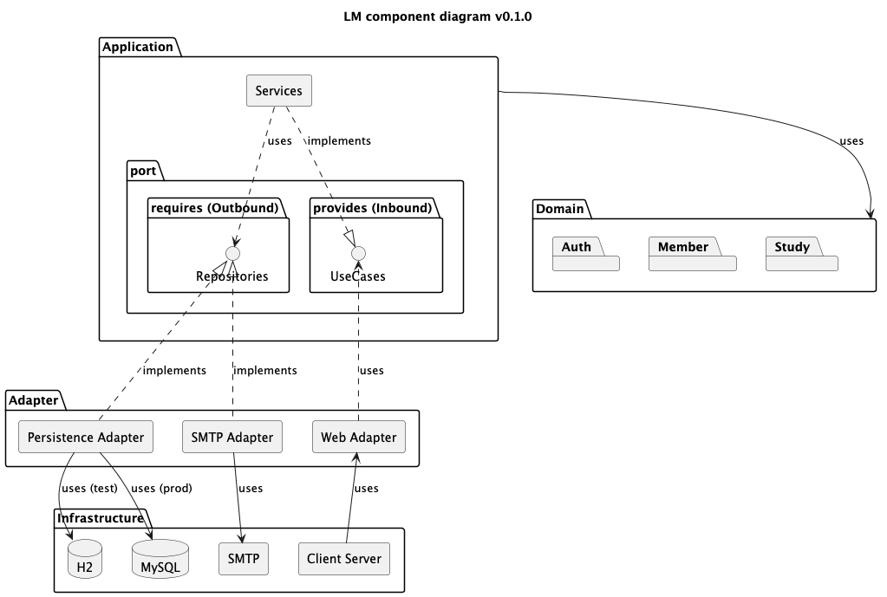

# Learning Manager

<div align="center">
  
</div>


## 🎯 프로젝트 목표
### 1. 학습에만 집중할 수 있는 스터디 인프라 제공 플랫폼 구축

### 2. 유지보수를 염두에 두고 쉽게 확장이 가능한 시스템 설계 

## 🧩 사용 기술
- 작성 예정

## 📝 프로토타입
- 작성 예정

## 📚 설계

### 패키지 구조

```plaintext
me.chan99k.learningmanager
├── domain/
│   ├── auth/
│   ├── member/
│   └── study/
├── application/
│   ├── port/
│   │   ├── provides/ (Inbound Port)
│   │   └── requires/ (Outbound Port)
│   └── service/
└── adapter/ (Adapter)
│   ├── web/
│   └── persistence/
```

### 커뮤니케이션 다이어그램
- 작성 예정

### 컴포넌트 다이어그램



### ER 다이어그램
- 작성 예정


### 브랜치 전략
> main 브랜치를 중심으로 하는 간단하고 효율적인 Trunk-Based Development에 가까운 브랜치 전략을 사용합니다. 

#### `main` 브랜치

* 역할: 가장 안정적인 상태의 코드를 관리하는 브랜치입니다. main 브랜치의 모든 커밋은 언제든지 배포 가능한 상태(Always Deployable)를 유지해야 합니다.


#### `feat` 브랜치 (기능 브랜치)

* 역할: 
  * 새로운 기능 개발, 버그 수정, 리팩토링 등 모든 종류의 코드 변경 작업을 수행하는 단기 브랜치입니다. 
  * 각 브랜치는 독립적인 하나의 Task에 집중합니다.
* 규칙:
    *  항상 최신 상태의 main 브랜치에서 분기합니다.
    * 이 브랜치의 목적을 명확히 알 수 있도록 다음과 같은 형식을 사용합니다.
      * `feat/{기능-요약}` _(예: feat/add-login-feature)_
      * `fix/{버그-요약}` _(예: fix/resolve-auth-issue)_
    * 개발이 완료되면 main 브랜치로 병합하기 위한 Pull Request(PR)를 생성합니다.
    *  main 브랜치로 성공적으로 병합된 후에는, 저장소를 깨끗하게 유지하기 위해 해당 feat 브랜치를 삭제하는 것을 원칙으로 합니다.
